# 🎵 Music1 - K-pop API 서비스

Spring Boot 기반의 K-pop 음악 정보 API 서비스입니다. AWS EKS를 이용한 자동 배포 시스템이 구축되어 있습니다.

## 🚀 주요 기능

- **음악 목록 조회**: 전체 K-pop 음악 정보 조회
- **음악 검색**: 장르별 음악 검색
- **좋아요 기능**: 음악에 좋아요 추가
- **헬스 체크**: Spring Boot Actuator를 통한 애플리케이션 상태 모니터링

## 🛠️ 기술 스택

- **Backend**: Spring Boot 3.5.3, Java 17
- **Build Tool**: Maven
- **Container**: Docker
- **Orchestration**: Kubernetes (AWS EKS)
- **CI/CD**: GitHub Actions
- **Container Registry**: AWS ECR
- **Monitoring**: Spring Boot Actuator

## 📚 API 엔드포인트

| Method | Endpoint | 설명 |
|--------|----------|------|
| GET | `/api/music` | 모든 음악 조회 |
| GET | `/api/music/{id}` | 특정 음악 조회 |
| GET | `/api/music/genre/{genre}` | 장르별 음악 검색 |
| POST | `/api/music/{id}/like` | 음악 좋아요 추가 |
| GET | `/actuator/health` | 애플리케이션 상태 확인 |

## 🔧 로컬 개발 환경 설정

### 1. 전제 조건
- Java 17 이상
- Maven 3.6+
- Docker (선택사항)

### 2. 애플리케이션 실행

```bash
# 1. 프로젝트 클론
git clone <repository-url>
cd docker-k8s

# 2. 의존성 설치 및 빌드
mvn clean package

# 3. 애플리케이션 실행
java -jar target/music1-0.0.1-SNAPSHOT.jar

# 또는 Maven을 통해 실행
mvn spring-boot:run
```

### 3. Docker를 이용한 실행

```bash
# 1. Docker 이미지 빌드
docker build -t music1-app .

# 2. 컨테이너 실행
docker run -p 8080:8080 music1-app
```

### 4. API 테스트

```bash
# 모든 음악 조회
curl http://localhost:8080/api/music

# 특정 음악 조회
curl http://localhost:8080/api/music/1

# 장르별 검색
curl http://localhost:8080/api/music/genre/K-pop

# 좋아요 추가
curl -X POST http://localhost:8080/api/music/1/like

# 헬스 체크
curl http://localhost:8080/actuator/health
```

## ☁️ AWS EKS 배포

### 1. 전제 조건
- AWS 계정
- GitHub 레포지토리
- AWS CLI 설치 및 구성

### 2. AWS 리소스 설정
자세한 설정 가이드는 [AWS_SETUP.md](./AWS_SETUP.md)를 참고하세요.

**필수 설정 항목:**
1. **ECR 레포지토리 생성** (`music1-app`)
2. **EKS 클러스터 생성** (`music1-cluster`)
3. **IAM 역할 및 정책 설정**
4. **GitHub Secrets 설정**
   - `AWS_ACCESS_KEY_ID`
   - `AWS_SECRET_ACCESS_KEY`

### 3. 자동 배포 프로세스

```mermaid
graph LR
    A[코드 푸시] --> B[GitHub Actions]
    B --> C[Maven 빌드]
    C --> D[Docker 이미지 생성]
    D --> E[ECR 푸시]
    E --> F[EKS 배포]
    F --> G[서비스 업데이트]
```



### 4. 수동 배포 (선택사항)

```bash
# 1. AWS 자격 증명 설정
aws configure

# 2. EKS 클러스터 연결
aws eks update-kubeconfig --region ap-northeast-2 --name music1-cluster

# 3. 배포 스크립트 실행
./deploy.sh

# 4. 포트 포워딩을 통한 테스트
kubectl port-forward service/music1-service -n music1-namespace 8080:80
```

## 🏗️ 프로젝트 구조

```
docker-k8s/
├── .github/
│   └── workflows/
│       └── deploy.yml              # GitHub Actions 워크플로우
├── k8s/
│   ├── namespace.yml               # Kubernetes 네임스페이스
│   ├── deployment.yml              # 애플리케이션 배포
│   └── ingress.yml                 # 인그레스 설정
├── src/
│   ├── main/
│   │   ├── java/
│   │   │   └── com/block/music1/
│   │   │       ├── controller/     # REST 컨트롤러
│   │   │       ├── model/          # 데이터 모델
│   │   │       ├── service/        # 비즈니스 로직
│   │   │       └── Music1Application.java
│   │   └── resources/
│   │       └── application.properties
│   └── test/
├── Dockerfile                      # Docker 이미지 빌드
├── pom.xml                         # Maven 설정
├── deploy.sh                       # 배포 스크립트
├── AWS_SETUP.md                    # AWS 설정 가이드
└── README.md                       # 프로젝트 문서
```

## 🔍 모니터링

### 1. 애플리케이션 상태 확인

```bash
# 파드 상태 확인
kubectl get pods -n music1-namespace

# 서비스 상태 확인
kubectl get services -n music1-namespace

# 애플리케이션 로그 확인
kubectl logs -f deployment/music1-deployment -n music1-namespace
```

### 2. 메트릭 엔드포인트
- **헬스 체크**: `/actuator/health`
- **애플리케이션 정보**: `/actuator/info`
- **메트릭**: `/actuator/prometheus` (Prometheus 통합)

## 💰 비용 관리

### 예상 월 비용 (서울 리전):
- **EKS 클러스터**: $72.00
- **EC2 인스턴스** (t3.medium x 2): ~$60.00
- **Load Balancer**: ~$16.00
- **NAT Gateway**: ~$45.00
- **총 예상 비용**: ~$193.00

### 비용 절약 팁:
1. **Spot 인스턴스** 사용 (50-70% 절약)
2. **불필요한 리소스** 정리
3. **오토 스케일링** 설정
4. **개발 환경은 필요시에만 실행**

## 🚨 보안 고려사항

1. **IAM 역할** 최소 권한 원칙 적용
2. **보안 그룹** 규칙 최소화
3. **Secrets 관리** (AWS Secrets Manager 권장)
4. **Container 보안** 스캐닝 활성화
5. **Network 정책** 적용

## 📞 문제 해결

### 자주 발생하는 문제:

1. **빌드 실패**: Java 17 버전 확인
2. **Docker 이미지 푸시 실패**: ECR 권한 확인
3. **EKS 배포 실패**: 클러스터 상태 및 노드 그룹 확인
4. **서비스 접근 불가**: 보안 그룹 및 로드밸런서 설정 확인

### 유용한 명령어:

```bash
# 클러스터 정보 확인
kubectl cluster-info

# 이벤트 확인
kubectl get events --sort-by=.metadata.creationTimestamp -n music1-namespace

# 파드 상세 정보
kubectl describe pod <pod-name> -n music1-namespace

# 서비스 엔드포인트 확인
kubectl get endpoints -n music1-namespace
```

## 🤝 기여하기

1. 이 레포지토리를 Fork
2. 기능 브랜치 생성 (`git checkout -b feature/AmazingFeature`)
3. 변경사항 커밋 (`git commit -m 'Add some AmazingFeature'`)
4. 브랜치에 Push (`git push origin feature/AmazingFeature`)
5. Pull Request 생성

## 📄 라이선스

이 프로젝트는 MIT 라이선스를 따릅니다.

## 📧 연락처

프로젝트 관리자: [Your Name](mailto:your.email@example.com)

프로젝트 링크: [https://github.com/yourusername/docker-k8s](https://github.com/yourusername/docker-k8s)